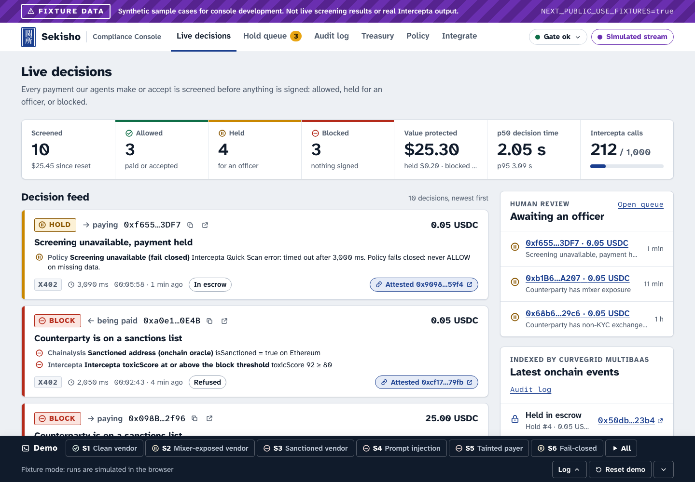
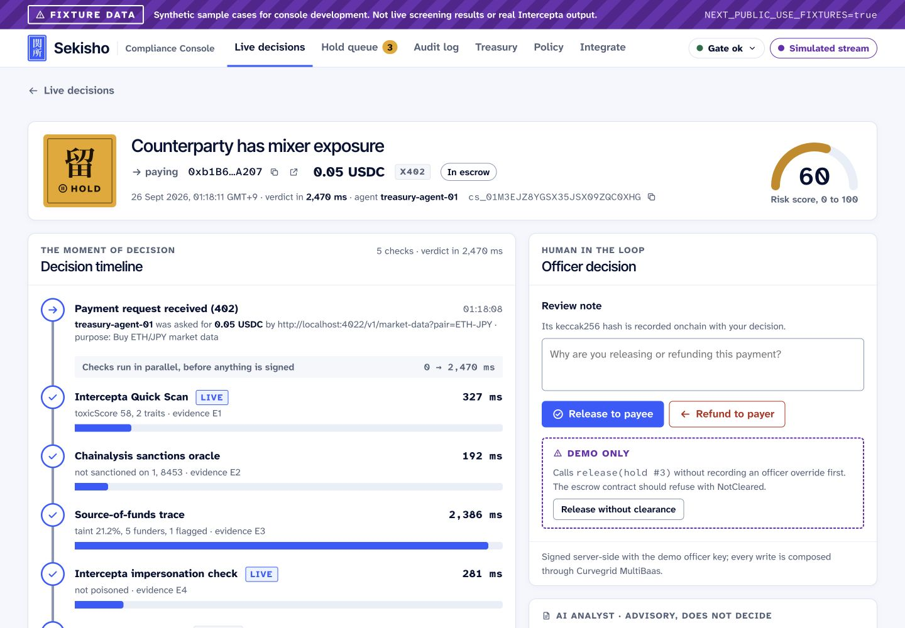
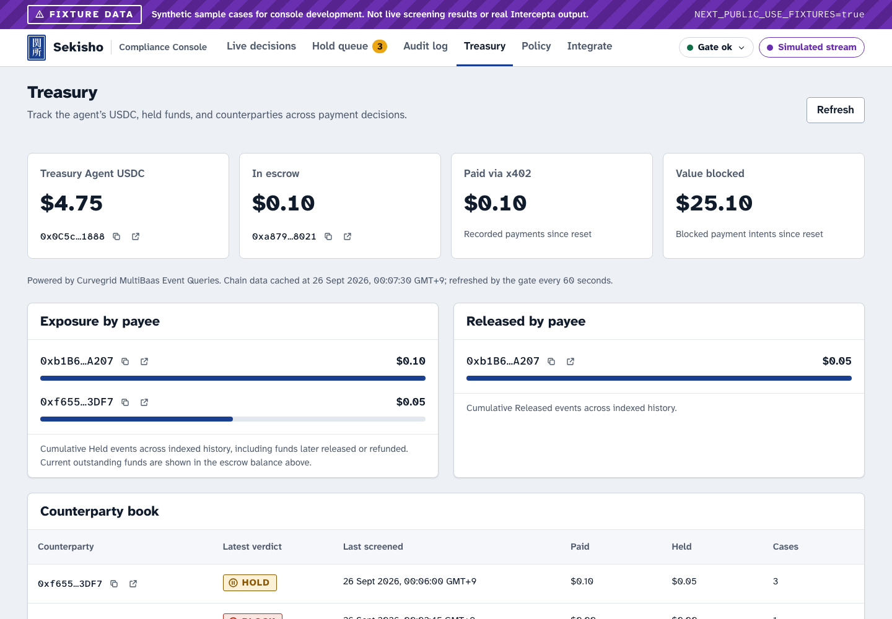

<a id="readme-top"></a>

<p align="center">
  
</p>

<p align="center">
  <strong>Screen before signing.</strong><br>
  Wallet evidence, deterministic decisions, and human review for AI agent payments.
</p>

<p align="center">
  <a href="https://getsekisho.vercel.app">Website</a> ·
  <a href="#getting-started">Try locally</a> ·
  <a href="docs/api.md">API reference</a> ·
  <a href="PITCH_PLAN.md">Demo plan</a> ·
  <a href="https://github.com/Ducksss/sekisho/issues">Report an issue</a>
</p>

<p align="center">
  <a href="https://github.com/Ducksss/sekisho/actions/workflows/ci.yml">CI checks</a> ·
  <a href="LICENSE">MIT licensed</a>
</p>


**Banks must know who they pay. AI agents are about to pay strangers at machine speed.**
Sekisho is the checkpoint every agent payment passes through. It screens the other wallet
before the agent signs, then allows the payment, holds it for a human, or blocks it, and
attests every decision onchain.

**ETHGlobal Tokyo 2026 judges:** [Intercepta integration](#intercepta-screening-at-the-moment-of-decision) ·
[Curvegrid MultiBaas](#curvegrid-multibaas-every-write-event-and-webhook) · [Team](#team) ·
[AI usage](#ai-usage-and-provenance) · [Guided walkthrough](https://getsekisho.vercel.app)
<!-- TODO(before submit): add the demo video link here once it is uploaded. -->

**Status (26 Sep 2026):** the gate, contracts, Python SDK, agents, MCP server and console
are implemented. 363 Python tests, 18 contract tests and 45 report-hash checks pass in
[CI](https://github.com/Ducksss/sekisho/actions/workflows/ci.yml) on `main`.
The remaining step is the live testnet run with keyed Intercepta and MultiBaas calls
([readiness checklist](docs/readiness.md)). Until then, screenshots and the website
walkthrough use labelled synthetic data.
<!-- TODO(before submit): once the live run is done, replace the last two sentences with
     the Base Sepolia contract addresses and one ALLOW, one HOLD and one BLOCK case. -->

<details>
<summary>Table of contents</summary>

- [About Sekisho](#about-sekisho)
- [Console walkthrough](#console-walkthrough)
- [Partner integrations](#partner-integrations)
- [Built with](#built-with)
- [Getting started](#getting-started)
- [Usage](#usage)
- [How it works](#how-it-works)
- [Verification](#verification)
- [Roadmap](#roadmap)
- [Team](#team)
- [AI usage and provenance](#ai-usage-and-provenance)
- [Contributing](#contributing)
- [License](#license)
- [Contact](#contact)
- [Acknowledgments](#acknowledgments)

</details>

## About Sekisho

An agent can buy an API response with USDC before a person sees the destination wallet.
Sekisho (関所, an Edo-era road checkpoint) puts a policy decision between that payment
request and the signature. It screens the counterparty with Intercepta, the Chainalysis
sanctions oracle, and a bounded source-of-funds trace.

| Verdict | Payment behavior |
|---|---|
| **ALLOW** | The payer hook may sign the x402 payment; the seller screens the payer before acceptance. |
| **HOLD** | Payment is held for review; the demo can deposit USDC into escrow for an officer to release or refund. |
| **BLOCK** | The payer hook refuses to sign; the payee hook refuses acceptance. |

The policy decides; AI only explains. Missing required screening data produces at least
HOLD. Registry attestations and officer overrides go through Curvegrid MultiBaas, while
the console lets reviewers compare the exact report bytes with the onchain report hash.

This is a **testnet demo policy**, not a certified AML programme or legal advice. An ALLOW
is a point-in-time policy decision, not a safety guarantee. Screening on mainnet is
read-only; value transfers use Base Sepolia. See [integration limits](docs/SETUP.md#integration-details-and-limits).

## Console walkthrough

**Actual console, synthetic data.** These screenshots were captured from the running
fixture preview. Balances, provider results, and transactions shown are simulated, not
evidence of live screening or settlement. The purple fixture banner stays visible.



<details>
<summary>Case review and treasury screenshots</summary>

**Case review:** inspect the screening timeline and record a release or refund decision.



**Treasury:** distinguish current balances from cumulative escrow exposure and releases.



</details>

## Partner integrations

### Intercepta: screening at the moment of decision

Both sides of every x402 payment are screened before anything is signed or accepted.

| Moment | What happens | Code |
|---|---|---|
| Before the buyer signs | The payer hook sends the vendor's `payTo` to the gate in x402 `on_before_payment_creation`. Only ALLOW lets x402 create a signature | [`sdk/sekisho/x402_hooks.py#L70`](sdk/sekisho/x402_hooks.py#L70) |
| Before the vendor accepts | The vendor screens the payer before x402 runs (HTTP 403 unless ALLOW), then again in `on_before_verify` | [`agents/vendors/app.py#L230`](agents/vendors/app.py#L230), [`sdk/sekisho/x402_hooks.py#L112`](sdk/sekisho/x402_hooks.py#L112) |

Each screen calls Intercepta from the gate ([client and endpoints](gate/sekisho_gate/screening/intercepta.py#L39)):

- **Quick Scan Address** on the counterparty, always live for the direct counterparty
  ([pipeline.py#L223](gate/sekisho_gate/screening/pipeline.py#L223)).
- **Scan Token** on the payment asset's mainnet equivalent: testnet USDC is checked as Base USDC
  ([pipeline.py#L242](gate/sekisho_gate/screening/pipeline.py#L242)).
- **Address-poisoning check** when enabled ([pipeline.py#L240](gate/sekisho_gate/screening/pipeline.py#L240)).
- **Quick Scan on direct funders** found by the source-of-funds trace, cached per address
  ([tracer.py#L644](gate/sekisho_gate/screening/tracer.py#L644)).
- **Deep Scan** after a hold, for the case file; it never changes the verdict
  ([pipeline.py#L405](gate/sekisho_gate/screening/pipeline.py#L405)).

The result decides the payment ([policy.yaml](gate/policy/policy.yaml#L17), [engine.py#L186](gate/sekisho_gate/policy/engine.py#L186)):

| Screening result | Verdict | What happens |
|---|---|---|
| Hard-block trait (for example, a sanctioned address) or toxic score of 80 or more | **BLOCK** | The payer hook aborts; no signature exists |
| Hold trait (for example, mixer exposure) or toxic score of 40 or more | **HOLD** | USDC waits in `ComplianceEscrow` until an officer releases or refunds it |
| Quick Scan failed, timed out or malformed | **HOLD** | Fail closed; an officer override can't lift this rule ([engine.py#L334](gate/sekisho_gate/policy/engine.py#L334)) |
| First payment to a new counterparty above 25 USD | **HOLD** | A human looks first ([engine.py#L394](gate/sekisho_gate/policy/engine.py#L394)) |

Spending is also capped at 1 USD per payment in the x402 client itself, independent of the gate
([tools.py#L766](agents/treasury/tools.py#L766)). The console shows Intercepta's trait
descriptions word for word. The demo runs S1 (clean vendor, ALLOW), S3 (sanctioned address,
BLOCK) and S2 (mixer-exposed funds, HOLD, then officer release); see the
[demo plan](PITCH_PLAN.md#3-live-demo-script-400-one-speaker).

**Our feedback on the Intercepta API**

- **Time to first call:** quick. `/llms.txt` and the Markdown version of each docs page let our
  coding agents read the reference directly, and the auth error is clear (403 with a readable
  message). <!-- TODO(before submit): add the time from receiving the key to the first keyed response. -->
- **Confusing:** one product with three names: intercepta.io, docs at docs.web3antivirus.io and
  the API at api.web3antivirus.io. docs.intercepta.io does not resolve.
- **Missing:** example response bodies for the address endpoints (the docs give schemas only),
  and documented responses for a never-seen wallet and for an exhausted quota. A fail-closed
  payment gate has to tell "clean" from "unknown" from "out of quota".
- **Would help most:** a chain parameter on the address scans, and one "screen this x402
  payment" call that takes the `payTo`, asset, amount and EIP-3009 authorization together.

### Curvegrid MultiBaas: every write, event and webhook

MultiBaas is Sekisho's path onchain:

- **Deploy and link.** `forge-multibaas` links `ComplianceRegistry` and `ComplianceEscrow` under
  stable aliases as part of deployment ([Deploy.s.sol#L33](contracts/script/Deploy.s.sol#L33)).
- **Every write through the REST API.** Each contract call is composed by MultiBaas, signed
  locally with the role's key and submitted through MultiBaas
  ([multibaas.py#L518](gate/sekisho_gate/chain/multibaas.py#L518),
  [#L539](gate/sekisho_gate/chain/multibaas.py#L539)). That covers screening attestations and
  officer overrides ([attest.py#L219](gate/sekisho_gate/chain/attest.py#L219)), escrow release and
  refund, and the treasury agent's escrow deposit ([tools.py#L666](agents/treasury/tools.py#L666)).
- **Webhooks drive case state.** HMAC-verified event webhooks confirm attestations and move
  cases to held, released or refunded ([webhooks.py#L154](gate/sekisho_gate/webhooks.py#L154)).
- **Event Queries power the treasury view.** Saved queries `exposure_by_payee` and
  `released_by_payee` feed the Treasury page
  ([setup_multibaas.py#L77](scripts/setup_multibaas.py#L77), [services.py#L324](gate/sekisho_gate/services.py#L324)).
- **One setup script** registers USDC, the webhook and the saved queries
  ([scripts/setup_multibaas.py](scripts/setup_multibaas.py)).

**Our experience with MultiBaas**

- **Wins:** every contract call is a REST call, so the Python gate needed no web3 stack for
  writes. Indexed events and webhooks replaced an indexer we would otherwise have written. The
  published OpenAPI spec let us check request shapes before we had a deployment.
- **Challenges:** the webhook sample in the docs and the spec disagree on the alias field
  (`addressLabel` or `addressAlias`). `GET /events` has no sort order and returns 10 rows by
  default, so we poll by transaction hash instead. Event Query `eventName` formats differ across
  official samples, and result keys come back lowercased. `forge-multibaas` links aliases during
  simulation, so a failed broadcast leaves aliases pointing at nothing, and a re-run returns 409
  unless both allow-update flags are set.
<!-- TODO(before submit): add notes from the live deployment (chain, plan limits, anything new). -->

## Built with

| Layer | Technology |
|---|---|
| Gate | Python 3.11, FastAPI, Pydantic, SQLite, server-sent events |
| Console | Next.js 16, React 19, TypeScript, SWR, viem |
| Contracts | Solidity, Foundry, OpenZeppelin; registry and USDC escrow |
| Agent integration | Python SDK, x402 payer/payee hooks, MCP server |
| Screening adapters | Intercepta, Chainalysis sanctions oracle, Blockscout source tracing |
| Onchain operations | Curvegrid MultiBaas writes, webhooks, indexed events, Event Queries |

Adapters are implemented; their live deployment and end-to-end verification remain on
the [roadmap](#roadmap). Exact installed versions are recorded in dependency locks and constraints.

## Getting started

### Explore the console without credentials

Prerequisites: **Git and Node.js 22 with npm**. No wallet or API key is needed.

```bash
git clone https://github.com/Ducksss/sekisho.git
cd sekisho/dashboard
npm ci
npm run dev:fixtures
```

Open [localhost:3000](http://localhost:3000). Look for the **FIXTURE DATA** banner.
The demo controls simulate scenarios in your browser; they do not submit transactions.

### Run the full testnet stack

Follow [Local setup and testnet rehearsal](docs/SETUP.md) for Python 3.11, Foundry,
service credentials, fresh testnet wallets, deployment, webhooks, and smoke checks.
Run `make help` from the repository root for all commands.

The normal console uses live gate data. Stop the fixture process before switching;
submitted builds must leave `NEXT_PUBLIC_USE_FIXTURES` unset or `false`. The running
gate has no mock mode. Keep all private keys and service secrets in the ignored `.env`.

## Usage

In the fixture preview:

1. Open **Live decisions** and use **S1 Clean vendor** or **S3 Sanctioned vendor** to
   compare ALLOW and BLOCK.
2. Run **S2 Mixer-exposed vendor**, open the held case, and inspect its evidence.
3. Enter an officer note and release or refund the simulated hold; check the hold queue.
4. Open **Audit log**, expand a confirmed case, and choose **Verify report**.
5. Open **Treasury** to compare balances with cumulative exposure. Use **Policy** and
   **Integrate** to inspect thresholds and SDK/MCP examples.

For the configured live stack, run `make demo S=S1`, then S3 and S2; review the hold in
the console. `make demo S=all` runs S1–S5 and waits for officer release during S2.
S6 tests fail-closed behavior under explicit timeout fault injection and runs separately.
See the [complete rehearsal sequence](docs/SETUP.md#demo-and-verification) and
[SDK integration guide](sdk/README.md).

## How it works

```text
Treasury Agent → x402 402 → payer hook → Sekisho Gate → policy verdict
                                         ↑                 │
Vendor Agent ← payee hook ← payer wallet  │                 ├ ALLOW → sign, settle
                                         │                 ├ HOLD → escrow → officer
              Intercepta + oracle + trace ┘                 └ BLOCK → no signature
                                                           │
                                   MultiBaas → registry/events/webhooks
                                                           │
                                         Console ← gate API + SSE
```

| Directory | Responsibility |
|---|---|
| [`gate/`](gate/) | Screening, deterministic policy, reports, advisory notes, attestations, SSE |
| [`contracts/`](contracts/) | ComplianceRegistry, ComplianceEscrow, tests, deployment |
| [`sdk/sekisho/`](sdk/sekisho/) | Gate client and x402 hooks |
| [`agents/`](agents/) | Treasury buyer, vendor APIs, rogue payer scenario |
| [`mcp/server.py`](mcp/server.py) | Gate tools for MCP agents |
| [`website/`](website/) | Public static landing page deployed on Vercel |
| [`dashboard/`](dashboard/) | Decisions, review queue, audit, treasury, policy, integration |
| [`scripts/`](scripts/) | Setup, scanning, smoke checks, demo control |

The [PRD](PRD.md) and [API contract](docs/api.md) define the shared schemas. The policy
file is hashed byte for byte. Report verification hashes the served canonical text,
not a reserialized object. Counterparty-supplied text never controls screening.

## Verification

From the repository root after full installation:

```bash
make test
npm --prefix dashboard run lint
npm --prefix dashboard run build
```

[CI](https://github.com/Ducksss/sekisho/actions/runs/36166877013) on `main`, 26 September 2026:
**363 Python tests, 18 contract tests (including 2 fuzz tests) and 45 report-hash checks
passed**, along with the console build and lint. Local browser checks covered desktop/mobile,
review actions, report verification, and recoverable data errors.
See [verification scope and limitations](docs/readiness.md#local-verification) and
[GitHub CI](https://github.com/Ducksss/sekisho/actions/workflows/ci.yml).
These checks do not establish live provider performance or settlement.

## Roadmap

- [x] Gate, deterministic policy, canonical reports, and screening adapters
- [x] Registry and escrow contracts with tests
- [x] x402 payer/payee hooks, agents, MCP, and demo scenarios
- [x] Console review, audit, treasury, policy, and integration flows
- [x] Credential-free fixture preview and local verification
- [ ] Configure live services, fund fresh testnet wallets, and deploy/link contracts
- [ ] Select real counterparties and capture real Intercepta profiles
- [ ] Rehearse S1–S5 twice and S6 separately with indexed onchain evidence
- [ ] Measure live latency, complete human review, and record the narrated demo

The [readiness checklist](docs/readiness.md) is the detailed handoff for the remaining work.
The [pitch plan](PITCH_PLAN.md) covers the ETHGlobal Tokyo 2026 demonstration.

## Team

- **Chai Pin Zheng** · GitHub [@Ducksss](https://github.com/Ducksss)
<!-- TODO(before submit): add each teammate's name, role and X or LinkedIn handle.
     Curvegrid's prize asks for a brief team intro with social handles. -->

## AI usage and provenance

The repository history starts on Fri 25 Sep 2026 at 22:03 JST. The team wrote the
[PRD](PRD.md) and [pitch plan](PITCH_PLAN.md), which open the history unchanged; the
contracts in `contracts/src/` come from the PRD's Appendix A. AI coding agents (Claude Code
as lead agent with subagents, and Codex) built the gate, SDK, agents, MCP server, console,
tests and docs from the PRD under the team's direction. Every prompt is committed in
[docs/prompts/](docs/prompts/README.md), and [docs/ai-usage.md](docs/ai-usage.md) maps each
area to how it was made. At runtime, AI only writes advisory case notes; the deterministic
policy decides every verdict.
<!-- TODO(before submit): say when the PRD (including the Appendix A contracts) was written
     and whether AI tools helped write it, and fill in "Team review" in docs/ai-usage.md. -->

## Contributing

Open an [issue](https://github.com/Ducksss/sekisho/issues) to discuss a change, or send a
focused pull request with validation. Read [AGENTS.md](AGENTS.md) for repository rules.
Keep changes small, preserve fail-closed behavior, and update the gate, SDK, and console
together when a shared schema changes. Do not commit keys, `.env`, or databases.
Record AI assistance and prompts in [docs/ai-usage.md](docs/ai-usage.md).

## License

Distributed under the [MIT License](LICENSE). Third-party dependencies retain their
own licenses; presentation asset provenance is recorded in [docs/assets](docs/assets/README.md).

## Contact

Maintained in [Ducksss/sekisho](https://github.com/Ducksss/sekisho).
For questions or bug reports, use [GitHub Issues](https://github.com/Ducksss/sekisho/issues).

## Acknowledgments

- README structure adapted from [Best-README-Template](https://github.com/othneildrew/Best-README-Template).
- Intercepta, Curvegrid MultiBaas, Chainalysis, Blockscout, and x402 provide the integration surfaces used by this project.
- Atkinson Hyperlegible Next/Mono and Inter Tight provide the console and brand typography through Fontsource.
- [Investflow](https://investflowtemplate.webflow.io/) inspired the [Sekisho visual direction](docs/BRAND-DIRECTION.md); the checkpoint illustration is original.
- [AI usage and committed prompts](docs/ai-usage.md) document the build; the earlier
  [Wallet Audit Trail concept](docs/pitch-deck.md) records the project's provenance.

[Back to top](#readme-top)
